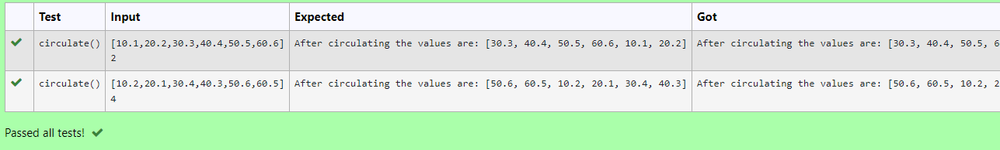

# Circulate-the-values-of-N-variables
## Aim:
To write a python program to circulate the n variables using function concept
## Equipment’s required:
PC
Anaconda - Python 3.7
## Algorithm: 
### Step 1: 
Define a function called circulate()
### Step 2: 
Get the list from user
### Step 3: 
Get the value from the user for the number of rotation
### Step 4: 
Using the slicing concept rotate the list
### Step 5: 
Print the output which gives a list after circulating the n variables
### Step 6: 
End the program
## Program:
```
#Program to circulate N values.
#Developed by: Ronick Aakshath P
#RegisterNumber: 22007303
def circulate():
    a = eval(input())
    n = int(input())
    b = a[n:] + a[:n]
    print("After circulating the values are:", b)
```
## Output:

## Result:
